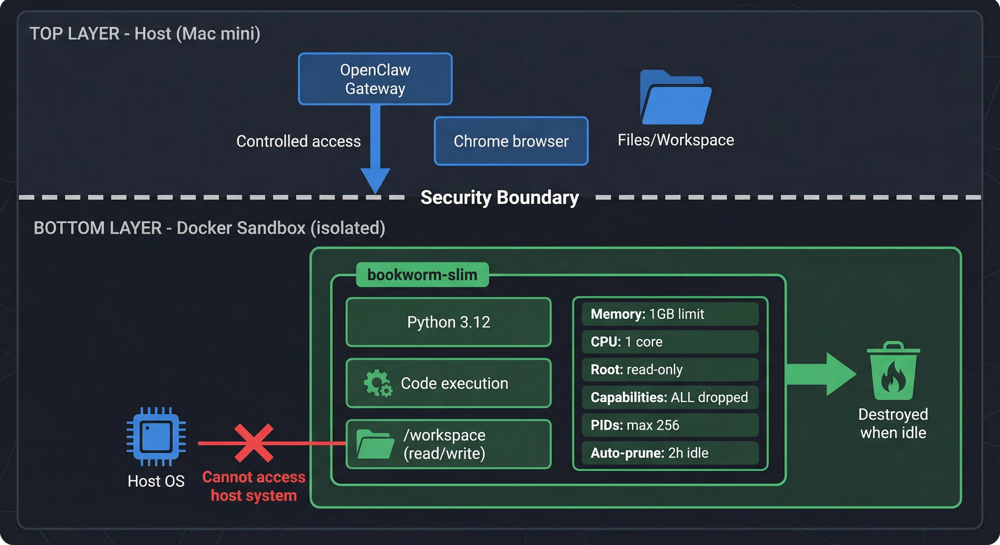

If we ask a model a question that requires external data, it cannot actually solve it on its own.

## Why?

<script src="https://asciinema.org/a/M8sXElBusgzmjZyq.js" id="asciicast-M8sXElBusgzmjZyq" async="true"></script>

The model tells us it cannot access real data.

This is expected. LLMs do not have internet access, and they should not execute arbitrary code.

But now we introduce a tool.

Instead of answering directly, the model can generate code that we run in a sandbox.

<script src="https://asciinema.org/a/pqMiIDYWE7zqd63h.js" id="asciicast-pqMiIDYWE7zqd63h" async="true"></script>

The model responds with Python code that fetches historical weather data and computes the averages.

[The Code](https://gist.github.com/ianpurton/8e8a77711baa660a2f95cd5ce7f57e18)

We take that code, execute it in a sandbox, and return the result.

```json
{
  "city": "London",
  "start_date": "2026-03-05",
  "end_date": "2026-03-11",
  "daily": [
    { "date": "2026-03-05", "average_temperature": 11.6, "unit": "°C" },
    { "date": "2026-03-06", "average_temperature": 9.1, "unit": "°C" },
    { "date": "2026-03-07", "average_temperature": 8.1, "unit": "°C" },
    { "date": "2026-03-08", "average_temperature": 8.8, "unit": "°C" },
    { "date": "2026-03-09", "average_temperature": 9.7, "unit": "°C" },
    { "date": "2026-03-10", "average_temperature": 10.1, "unit": "°C" },
    { "date": "2026-03-11", "average_temperature": 10.0, "unit": "°C" }
  ]
}
```


<script src="https://asciinema.org/a/4QTkXph3U8yz4NQT.js" id="asciicast-4QTkXph3U8yz4NQT" async="true"></script>

Now the model can solve problems that require:

- APIs
- computation
- data processing

This pattern is sometimes called a Code Interpreter, Sandbox Tool, or Agent Tool Execution.

But the moment you do this, a new problem appears.

You are now executing code written by an LLM.

That means you need a sandbox.

## Just Use a Docker Container



A common first idea is: just run the code inside Docker.

There are even projects like:

- <https://github.com/agent-infra/sandbox>

A simple sandbox image might look like this:

```Dockerfile
FROM python:3.11-slim

WORKDIR /sandbox

RUN pip install --no-cache-dir \
    requests \
    numpy \
    pandas \
    matplotlib \
    scipy \
    scikit-learn \
    beautifulsoup4 \
    lxml

RUN useradd -m sandbox
USER sandbox

CMD ["python"]
```

Then we execute the generated script.

```sh
docker build -t python-sandbox .
docker run --rm -v "$PWD/script.py:/sandbox/script.py:ro" python-sandbox python /sandbox/script.py
```

For a single-user demo, this works perfectly.

But once you move beyond a demo, things change quickly.

## The Multi-User Reality

As soon as multiple users are involved, the problem becomes architectural.

You cannot just call `docker run` anymore.

You now need to manage:

- one container per execution
- request queues
- timeouts
- resource limits
- network restrictions
- container cleanup
- per-user quotas

The system quickly turns into something like this:

```text
request -> queue -> worker -> container -> result -> destroy container
```

At this point you are no longer just running a container.

You are building a distributed job execution system.

This is the moment many teams realise they are reinventing infrastructure.

## Who Has Already Solved This?

Several projects are already exploring this space:

- <https://github.com/vercel-labs/just-bash>
- <https://github.com/pydantic/monty>
- <https://cloud.google.com/blog/products/containers-kubernetes/agentic-ai-on-kubernetes-and-gke>

These systems manage things like:

- sandbox lifecycle
- resource isolation
- job scheduling
- scaling execution environments

Which brings us to the next step.

## Sandboxing on Kubernetes

Many teams eventually run these sandboxes on Kubernetes.

Why?

Because Kubernetes already solves several problems we just described:

- scheduling workloads
- isolating containers
- scaling execution workers
- managing resource limits
- cleaning up completed jobs

Instead of writing your own orchestration layer, you can create ephemeral jobs or pods that execute sandboxed code.


## The Takeaway

Adding a sandbox tool looks simple.

But once real users are involved, you are designing:

- a sandbox
- a scheduler
- a job execution system
- and sometimes a multi-tenant security boundary

This is why many modern AI systems build on top of container orchestration or purpose-built sandbox infrastructure rather than calling `docker run` directly.
