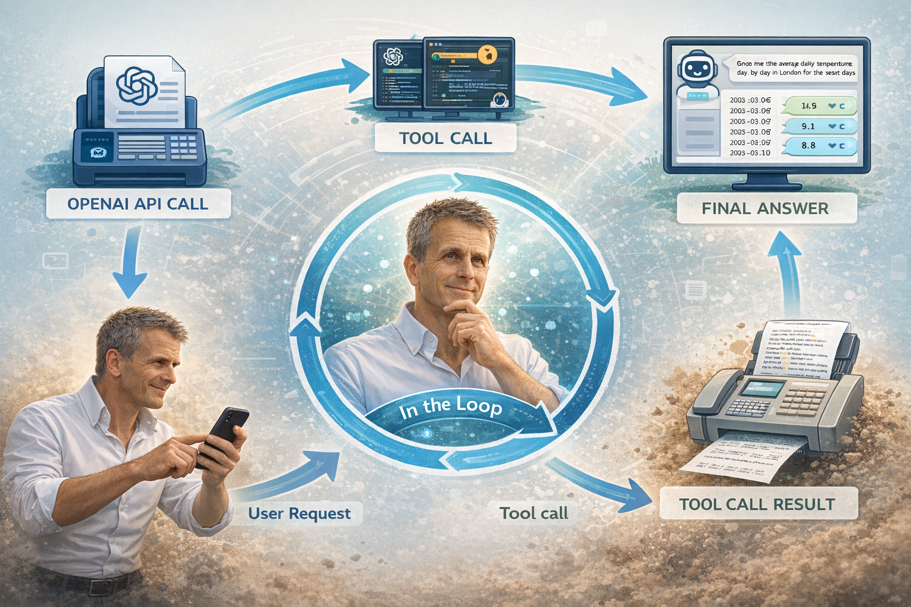
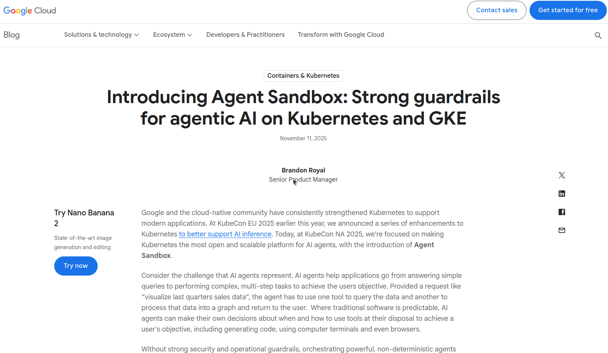
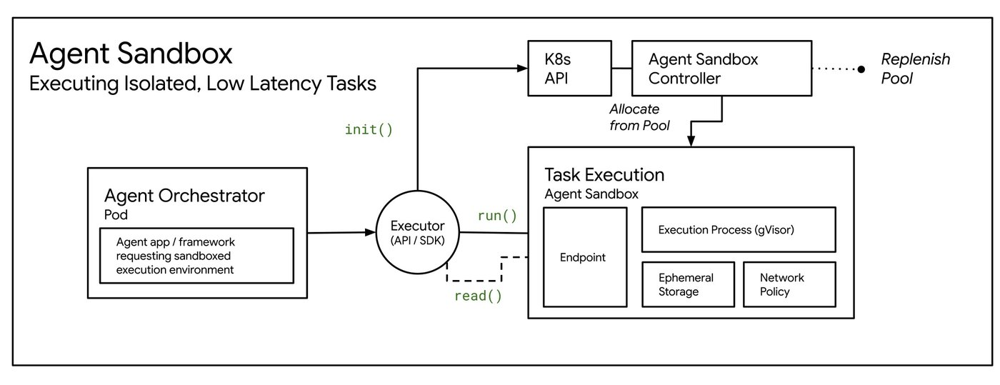

If we ask a model a question that requires external data, it cannot actually solve it on its own.

## Why?

<script src="https://asciinema.org/a/M8sXElBusgzmjZyq.js" id="asciicast-M8sXElBusgzmjZyq" async="true"></script>

The model tells us it cannot access real data.

This is expected. LLMs do not have internet access, and they should not execute arbitrary code.

But now we introduce a tool.

Instead of answering directly, the model can generate code that we run in a sandbox.

<script src="https://asciinema.org/a/pqMiIDYWE7zqd63h.js" id="asciicast-pqMiIDYWE7zqd63h" async="true"></script>

The model responds with Python code that fetches historical weather data and computes the averages.

[The Code](https://gist.github.com/ianpurton/8e8a77711baa660a2f95cd5ce7f57e18)

We take that code, execute it in a sandbox, and return the result.

```json
{
  "city": "London",
  "start_date": "2026-03-05",
  "end_date": "2026-03-11",
  "daily": [
    { "date": "2026-03-05", "average_temperature": 11.6, "unit": "°C" },
    { "date": "2026-03-06", "average_temperature": 9.1, "unit": "°C" },
    { "date": "2026-03-07", "average_temperature": 8.1, "unit": "°C" },
    { "date": "2026-03-08", "average_temperature": 8.8, "unit": "°C" },
    { "date": "2026-03-09", "average_temperature": 9.7, "unit": "°C" },
    { "date": "2026-03-10", "average_temperature": 10.1, "unit": "°C" },
    { "date": "2026-03-11", "average_temperature": 10.0, "unit": "°C" }
  ]
}
```


<script src="https://asciinema.org/a/4QTkXph3U8yz4NQT.js" id="asciicast-4QTkXph3U8yz4NQT" async="true"></script>

Now the model can solve problems that require:

- APIs
- computation
- data processing

This pattern is sometimes called a Code Interpreter, Sandbox Tool, or Agent Tool Execution.

But the moment you do this, a new problem appears.

You are now executing code written by an LLM.

That means you need a sandbox.



## Can we do this with Docker Containers?

<iframe src="./presentation.html" width="100%" height="600" style="border:0;" allowfullscreen></iframe>


## Sandboxing on Kubernetes






```yaml
apiVersion: agents.x-k8s.io/v1alpha1
kind: Sandbox
metadata:
  name: my-sandbox
spec:
  podTemplate:
    spec:
      containers:
      - name: my-container
        image: <IMAGE>
```

## The Takeaway

Adding a sandbox tool looks simple.

But once real users are involved, you are designing:

- a sandbox
- a scheduler
- a job execution system
- and sometimes a multi-tenant security boundary

This is why many modern AI systems build on top of container orchestration or purpose-built sandbox infrastructure rather than calling `docker run` directly.
