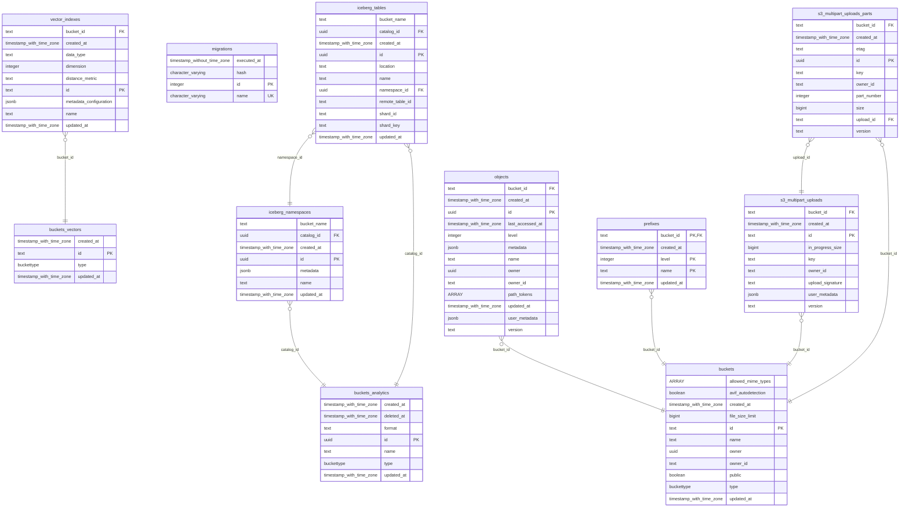
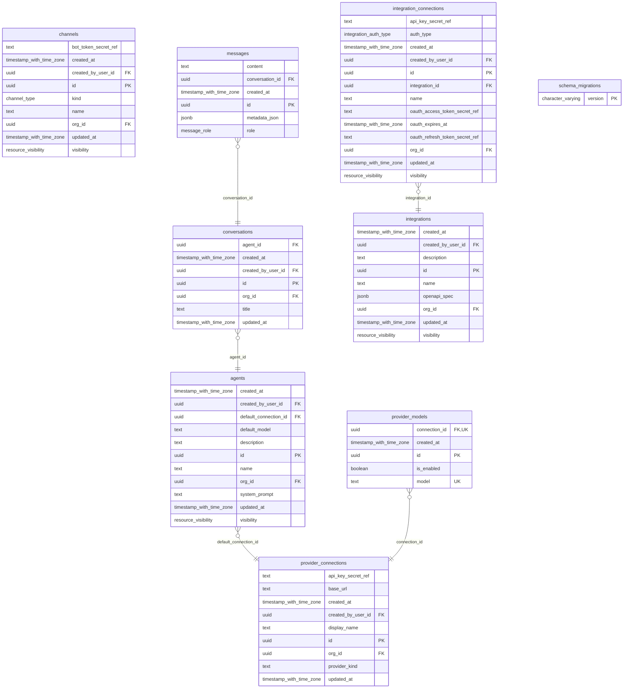

## The Database

We use 2 main tools to manage the database

- `dbmate` For schema migrations
- `cornucopia` for generating rust code from `sql` files.
- `just -f crates/db/Justfile db-diagram` add schema diagrams to REDME.md

## Database Schemas

Run `just -f crates/db/Justfile db-diagram` to refresh the diagrams.

<!-- schemas-start -->
### `iam`

Identity, access, roles, teams, and memberships.

```mermaid
erDiagram
```

### `integrations`

External integrations, connections, and OpenAPI specs.

```mermaid
erDiagram
```

### `llm`

Chat conversations, messages, and runtime limits.

```mermaid
erDiagram
```

### `assistants`

Prompts, categories, and project metadata for assistants.

```mermaid
erDiagram
```

### `automation`

Automation triggers and execution history.

```mermaid
erDiagram
```

### `rag`

Datasets, documents, chunks, and retrieval metadata.

```mermaid
erDiagram
```

### `model_registry`

Model providers, models, and capabilities.

```mermaid
erDiagram
```

### `storage`

Stored binary objects and references.



### `ops`

Operational data like audit trails and translations.

```mermaid
erDiagram
```

### `public`

Legacy schema for extensions, helpers, and compatibility objects.


<!-- schemas-end -->